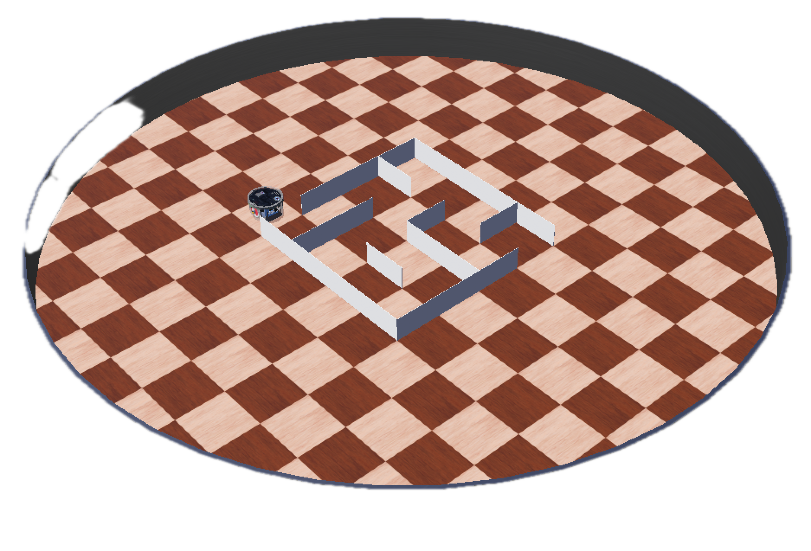
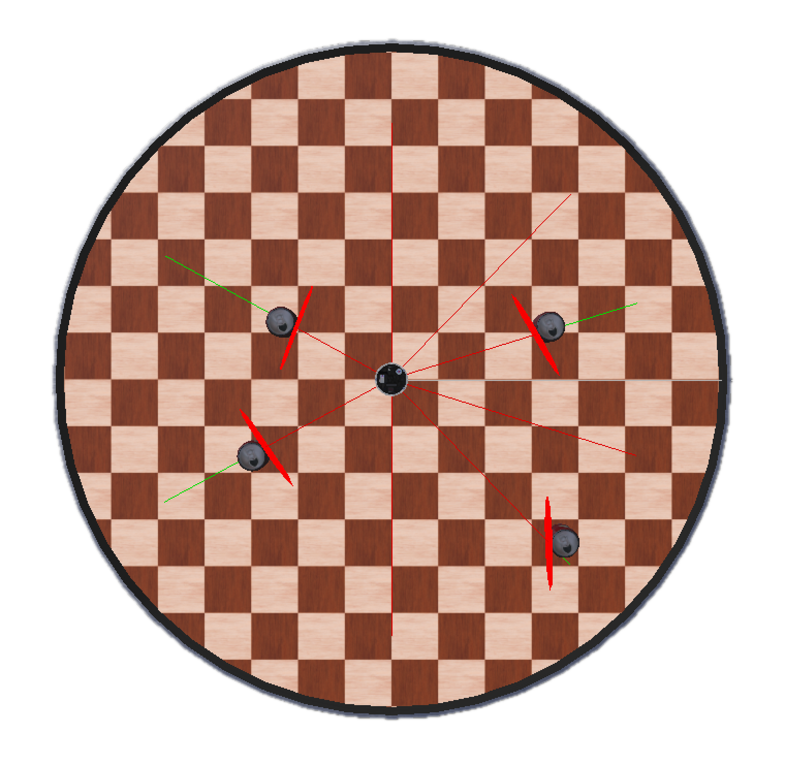
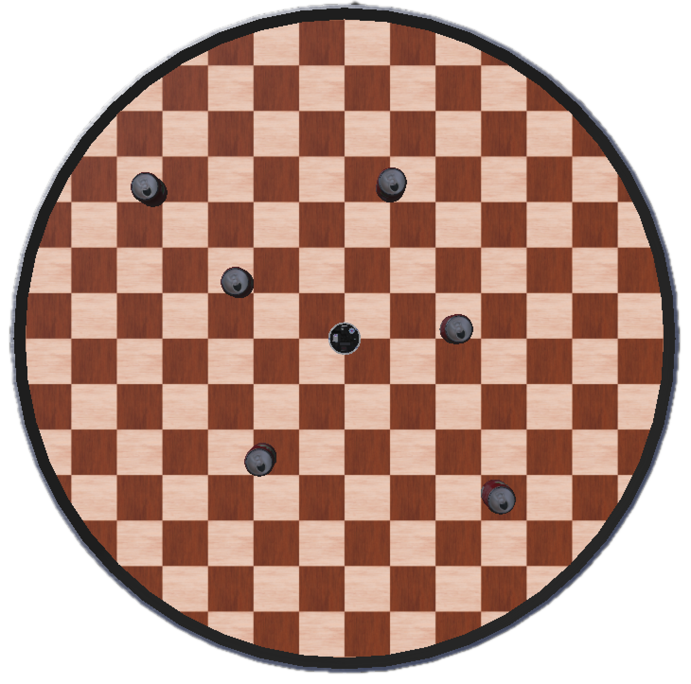

# MTRN2500 Webots Starter Repository

This repository is a Webots project containing world and proto files for you to use in the labs and tutorials.

## Getting Started

1. You should create a copy of this repository by clicking the fork button:
<a href="https://github.com/UNSW-MTRN2500/mtrn2500-webots-starter/fork">
    
</a>

1. clone the forked repository (replacing `YOUR_USER_NAME` with your real user):
    ```bash
    git clone git@github.com:YOUR_USER_NAME/mtrn2500-webots-starter.git
    ```

## World Files

**empty.wbt** contains just a single epuck:


**maze.wbt** contains an epuck at the start of a small maze:



**cans1.wbt** contains an epuck surrounded by cans:



**cans2.wbt** contains an epuck surrounded by cans:



**twopucks.wbt** contains two epucks named "e-puck-1" and "e-puck-2":


> Noise and sources of error have been removed or minimised from the robot and world description files.